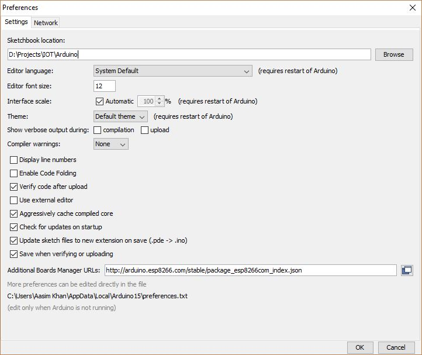
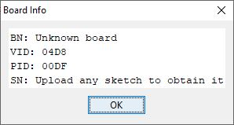
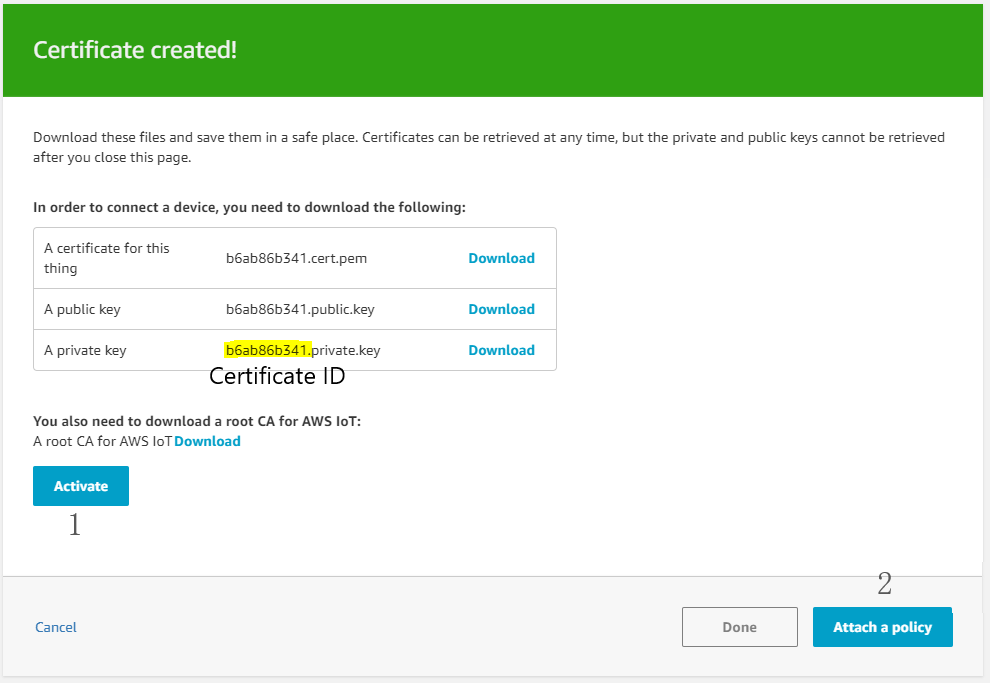

# Introduction
Internet of things is a hot-buzz-word in the field of AI these days. However, the concept was developed about 20 years ago by [@kevin_ashton][URL_KEVIN_ASHTON]. Let's have a simple definition to get it introduced.

The network of small devices connected with sensors, which can communicate over the internet and are capable of sending/recieving data and trigger some action based on certain conditions.

There is a lot more in introduction itself like application areas, communication architecture, security and much more. I would suggest going through the IoT's [wiki][URL_IOT_WIKI].

I am going to show how to configure nodemcu with AWS with security certificates. I have selected nodemcu as IoT device and DHT11 temperature sensor, both are easily available online. **The basic idea is to get notification using AWS serveless stack when the temperature hits too high**. Now let's configure the device and feed some code to it.

Setting Up The Device
To get started, you need to install

Ardruino IDE ([download][URL_ARDUINO_IDE])
NodeMCU Driver (download [CH340][URL_CH340] or [CP210x][URL_CP210x]) check the name on nodemcu. 
 

### Step #1

Open arduino IDE preferences and update "Additional Boards Manager URLs" value with
`http://arduino.esp8266.com/stable/package_esp8266com_index.json`

### Step #2

**Open Tools -> Boards -> Board Manager**. Search for **esp8266** and install it.

Now select **Tools -> Boards -> NodeMCU 1.0(ESP-12E Module)** and connect your device to USB port. Check if your device is working fine, or you are connected to the correct port by clicking on **Tools -> Board Info**. You will get a pop-up window(see image below).

If it throws an error, try changing port listed under **Tool -> Port**. If you are still getting error, then probably the driver is not installed properly.

 

### Step #3

Search and install required libraries under **Sketch -> Include Library -> Manage Libraries**

DHT sensor library (by Adafruit)
PubSubClient (by Nick O'Leary)
 

### Step #4

Now go to AWS IoT Core and create a policy. You will need this while creating the certificates. Replace aws account id, you can find it in your aws account settings.

{
  "Version": "2012-10-17",
  "Statement": [
    {
      "Effect": "Allow",
      "Action": "iot:*",
      "Resource": "arn:aws:iot:us-east-1:AWS_ACCOUNT_ID:*"
    }
  ]
}


 

### Step #5

Create certificates and download them from **Security -> Certificates using "One-click certificate creation"**. Activate the certificate and attach the policy that you have created in the previous step.

 

> To check the certs are in action. When you perform step #8 successfully, just deactivate the certificate and try reconnecting again. You will not be able to connect the until the certificate is activated. 

 

### Step #6

Coding Time! Replace the placeholders with your values. Use any text editor to open the downloaded certificatates.

#include <DHT.h>
#include <ESP8266WiFi.h>
#include <PubSubClient.h>
extern "C" {
#include "libb64/cdecode.h"
}

#define DHTPIN 4
#define DHTTYPE DHT11

DHT dht(DHTPIN,DHTTYPE);

struct dht11
{
  float humidity;
  float heatIndex;
  float temp;
};

int led_counter = 0;
int led_state = LOW;
struct dht11 sensor_data;
int read_sensor(struct dht11* data);
char sensorData;

// Update these with values suitable for your network.
const char* ssid = "<WIFI_SSID>";
const char* password = "<WIFI_PASSOWRD>";
const char* awsEndpoint = "<AWS_IOT_ENDPOINT>";
const char* DEVICE_ID = "<CUSTOM_DEVICE>";
const char* PUBLISH_TOPIC = DEVICE_ID;
const char* SUBSCRIBE_TOPIC = "<TOPIC_TO_SUBSCRIBE>";

const String certificatePemCrt = '<AWS_CERTIFICATE_PEM>'
const String privatePemKey = '<AWS_PRIVATE_PEM>'

int timeSinceLastRead = 0;
WiFiClientSecure wiFiClient;
void callback(char* topic, byte* payload, unsigned int len);
PubSubClient client(awsEndpoint, 8883, callback, wiFiClient);
long lastMsg = 0;
char msg[200];
int value = 0;
int analog_pin = A0;

void setup() {
  pinMode(BUILTIN_LED, OUTPUT);
  pinMode(analog_pin, INPUT);
  Serial.begin(115200);
  setup_wifi();
}

void setup_wifi() {
  Serial.print("Connecting to ");
  Serial.println(ssid);
  WiFi.begin(ssid, password);
  while (WiFi.status() != WL_CONNECTED) {
    delay(500);
    Serial.print(".");
  }
  Serial.println("IP address: ");
  Serial.println(WiFi.localIP());
  Serial.print("MAC: ");
  Serial.println(WiFi.macAddress());
  uint8_t binaryCert[certificatePemCrt.length() * 3 / 4];
  int len = b64decode(certificatePemCrt, binaryCert);
  wiFiClient.setCertificate(binaryCert, len);
  uint8_t binaryPrivate[privatePemKey.length() * 3 / 4];
  len = b64decode(privatePemKey, binaryPrivate);
  wiFiClient.setPrivateKey(binaryPrivate, len);
}

void callback(char* topic, byte* payload, unsigned int length) {
  Serial.print("Message arrived [");
  Serial.print(topic);
  Serial.print("] ");
  for (int i = 0; i < length; i++) {
    Serial.print((char)payload[i]);
  }
}

void reconnect() {
  // Loop until we're reconnected
  while (!client.connected()) {
    Serial.print("Attempting MQTT connection...");
    // Attempt to connect
    if (client.connect(DEVICE_ID)) {
      Serial.println("connected");
      client.subscribe(SUBSCRIBE_TOPIC);
    } else {
      Serial.print("failed, rc=");
      Serial.print(client.state());
      Serial.println(" try again in 5 seconds");
      // Wait 5 seconds before retrying
      delay(5000);
    }
  }
}

void loop() {
  if (!client.connected()) {
    reconnect();
  }
  client.loop();
  long now = millis();
  if (now - lastMsg > 60000) {
    lastMsg = now;
    if(read_sensor(&sensor_data)==0)
    {
      char str_temp[6],str_humidity[6],str_hi[6];
      dtostrf(sensor_data.temp, 4, 2, str_temp);
      dtostrf(sensor_data.humidity, 4, 2, str_humidity);
      dtostrf(sensor_data.heatIndex, 4, 2, str_hi);
      snprintf(msg,100,"{\"device_id\":\"%s\",\"temperature\":\"%s\",\"humidity\":\"%s\",\"heat_index\":\"%s\"}",DEVICE_ID,str_temp,str_humidity,str_hi);
      Serial.print("Publish message: ");
      Serial.println(msg);
      client.publish(PUBLISH_TOPIC, msg);
    }
  }
  else if (now - lastMsg > 1000) {
    if(led_counter) {
      led_state = (led_state)?LOW:HIGH;
      digitalWrite(BUILTIN_LED, led_state);
    }
  }
}
int read_sensor(struct dht11* data) {
  data->humidity = dht.readHumidity();
  data->temp = dht.readTemperature();
  if(isnan(data->humidity)||isnan(data->temp)) {
    Serial.println("DHT11 Read Failed");
    return 1;
  }
  data->heatIndex = dht.computeHeatIndex(data->temp,data->humidity,false);
  return 0;
}

int b64decode(String b64Text, uint8_t* output) {
  base64_decodestate s;
  base64_init_decodestate(&s);
  int cnt = base64_decode_block(b64Text.c_str(), b64Text.length(), (char*)output, &s);
  return cnt;
}


Take a close look at the code and verify values that you have updated. Now compile and upload the code to your device.

The source is also available on GitHub [here][URL_GH_SRC]. 

 

### Step #7

Disconnect the device and connect the sensor to the following pins on the Nodemcu.

- Connect + to 3v3 (Voltage Pin)
- Connect - to GND (Ground Pin)
- Connect out to D2 (Data Pin)
 

### Step #8

Check the connections.

Reconnect your device via USB and open **Tools -> Serial Monitor**. You will see the output of the iot device here. Now, go to AWS IoT and on the main dashboard, click on "Test" in the sidebar menu. Enter device id and subscribe to it. At this point, you should start getting data on the AWS IoT.

If you encounter any error here, check the "Serial Monitor." There might be connection issue with network or your temperature sensor may not send data to the IoT device.

So far, you are able to connect the IoT device to AWS cloud. Now we are good to go to part 2, which is focused on the backend that manages data from IoT device and notifications.

Continue to [part 2][URL_P2]

[URL_KEVIN_ASHTON]: https://twitter.com/kevin_ashton/
[URL_IOT_WIKI]: https://en.wikipedia.org/wiki/Internet_of_things
[URL_ARDUINO_IDE]: https://www.arduino.cc/en/Main/Software
[URL_CH340]: https://sparks.gogo.co.nz/ch340.html 
[URL_CP210x]: https://www.silabs.com/products/development-tools/software/usb-to-uart-bridge-vcp-drivers/
[URL_GH_SRC]: https://github.com/aasimmk/aws-iot-notifications/
[URL_P2]: /iot-notification-using-aws-part-2/
